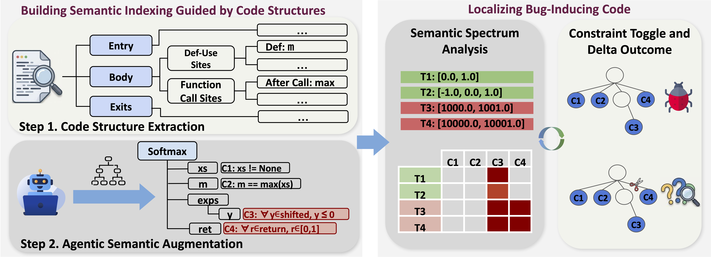
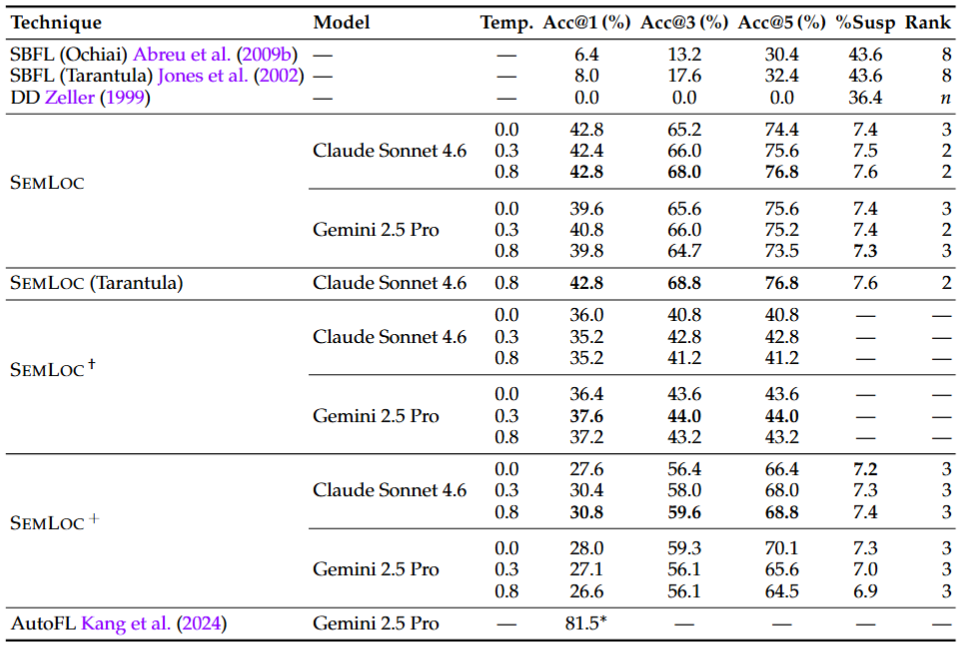

# 🔍 SemLoc: Semantic Spectra for Fault Localization

> **Structured Grounding of Free-Form LLM Reasoning for Fault Localization**
>
> 📄 [Paper](#-paper--citation) · 🗂️ [Benchmark](#-semfault-250-benchmark) · 🚀 [Quick Start](#-quick-start) · 📊 [Results](#-evaluation-results)

---

SemLoc is a fault localization framework that replaces syntactic spectra with **semantic spectra** — constraint-by-test violation matrices grounded in program behavior rather than statement coverage.

Given a buggy Python program and a failing test suite, SemLoc:
1. 🤖 Uses an LLM to **infer structured semantic constraints** anchored to typed program locations (entries, def-use sites, loop boundaries, return points)
2. 🔧 **Instruments** the program to check constraints at runtime
3. 📈 Builds a **semantic violation spectrum** across all tests and ranks suspicious lines via Ochiai scoring
4. ✅ Applies **counterfactual verification** to prune noise and confirm causal constraints

<!-- Workflow figure — export figures/ASE26_Workflow.pdf to figures/workflow.png -->


---

## 📊 Evaluation Results

SemLoc achieves **42.8% Acc@1** and **68% Acc@3** on the SemFault-250 benchmark, outperforming spectrum-based fault localization (6.4% / 13.2%) and delta debugging (0% / 0%) — while flagging only **7.3% of executable lines** as suspicious (an **6× reduction** compared to SBFL).

<!-- Results figure — export figures/rq1_acc_compact.pdf to figures/results.png -->


---

## 📄 Paper & Citation

> **[Paper link — coming soon]**

<!-- Replace with actual author list -->
**Authors:** [Zhaorui Yang](placeholder), [Haichao Zhu](placeholder), [Qian Zhang](placeholder), [Rajiv Gupta](placeholder), [Ashish Kundu](placeholder)


<details>
<summary>📋 BibTeX</summary>

```bibtex
@inproceedings{semloc2026,
  title     = {SemLoc: Structured Grounding of Free-Form LLM Reasoning for Fault Localization},
  author    = {Author, First and Author, Second and Author, Third},
  booktitle = {Proceedings of the ... Conference on ...},
  year      = {2026},
  doi       = {10.1145/nnnnnnn.nnnnnnn},
}
```

</details>

---

## ⚡ Quick Start

**Requirements:** Python ≥ 3.10

```bash
git clone https://github.com/your-org/semloc
cd semloc
pip install -e .
```

### 🎬 Try the demo (no API key needed)

Run SemLoc on a bundled benchmark example using pre-computed constraints:

```bash
semloc demo --skip-llm
```

This runs the full pipeline on `batchnorm_running_mean` — a numerical bug in an exponential moving average implementation — and prints the ranked suspicious lines alongside the ground truth fault.


To run the demo **with live LLM inference** (requires an API key):

```bash
export OPENAI_API_KEY="sk-..."
semloc demo --model gpt-4o --program batchnorm_running_mean
```

### Localize a bug in your own program

```bash
# Set your LLM API key (OpenAI, Gemini, or Claude via Vertex AI)
export OPENAI_API_KEY="sk-..."   # → use --model gpt-4o
# export GEMINI_API_KEY="..."    # → use --model gemini-2.5-pro
# (Claude on Vertex AI uses gcloud application-default credentials)

semloc locate \
  --program my_module.py \
  --tests   test_my_module.py \
  --model   gpt-4o \
  --out-dir run1
```

SemLoc prints a ranked list of suspicious lines with scores and highlights the top suspect.

### Run individual pipeline steps

Use `--steps` to run only specific stages (comma-separated). Steps are:

| Step | Key | What it does |
|------|-----|--------------|
| 1 | `tests` | Collect passing / failing test names |
| 2 | `infer` | Query LLM to generate semantic constraints |
| 3 | `instrument` | Inject runtime checks into program |
| 4 | `violations` | Run instrumented tests, collect violation log |
| 5 | `matrix` | Build constraint-by-test violation matrix |
| 6 | `score` | Compute Ochiai suspiciousness scores |
| 7 | `locate` | Rank lines and print localization report |

```bash
# Re-run only scoring and localization (reuse prior violations)
semloc locate \
  --program my_module.py \
  --tests   test_my_module.py \
  --out-dir run1 \
  --steps   score,locate

# Skip LLM — supply pre-computed constraints
semloc locate \
  --program    my_module.py \
  --tests      test_my_module.py \
  --constraints my_constraints.json \
  --out-dir    run1
```

### Model selection

The `--model` flag selects both the model and the API backend:

| Model prefix | Backend | Required credential |
|---|---|---|
| `gpt-*` / `o*` | OpenAI API | `OPENAI_API_KEY` |
| `gemini-*` | Google Gemini API | `GEMINI_API_KEY` |
| `claude-*` | Anthropic on Vertex AI | `ANTHROPIC_VERTEX_PROJECT_ID` + `CLOUD_ML_REGION` |

```bash
semloc locate --help    # full option reference
```

---

<a name="-semfault-250-benchmark"></a>
## 🗂️ SemFault-250 Benchmark

The **SemFault-250** benchmark contains 250 Python programs spanning financial systems, rate limiting, cache management, stream processing, and machine learning operations — each with a single semantic fault.

```
benchmark/
  programs/      ← buggy source programs
  testcases/     ← pytest test suites
  ground_truth.json
```

Passing `--ground-truth` (or placing `ground_truth.json` in the benchmark root) shows known buggy lines alongside SemLoc's predictions in the localization report.

---

## 🔬 Reproducing Paper Results

Pre-computed results are included and require no API keys:

```bash
semloc report --all        # print all RQ1–RQ3 tables
semloc report --rq1        # RQ1: Acc@1/3/5, Med.Rank, %Susp
semloc report --rq2        # RQ2: constraint quality statistics
semloc report --rq3        # RQ3: BugsInPy real-world evaluation
```

To re-run experiments from scratch:

```bash
cp config.sh myconfig.sh
nano myconfig.sh            # add your API keys
source myconfig.sh

bash scripts/reproduce_rq1.sh   # RQ1 — fault localization effectiveness
bash scripts/reproduce_rq2.sh   # RQ2 — constraint ablation
bash scripts/reproduce_rq3.sh   # RQ3 — BugsInPy real-world bugs
```

Pre-computed result locations:

| RQ | Directory | Key file |
|---|---|---|
| RQ1 (all configs) | `results/RQ1/<config>/results_cf_base/` | `summary.json` |
| RQ2 constraint data | `results/RQ2/claude_T0.8/` | `constraints/`, `violations/` |
| RQ3 BugsInPy | `results/RQ3/bugsInPy_results/` | one JSON per bug |

---

## 🏗️ Architecture

```
buggy program + tests
       │
       ▼
constraint_inference.py ──► LLM ──► constraints/*.json   (cbfl-ir schema)
       │
       ▼
instrumentation.py ──► instrumented source with __cbfl.check() calls
       │
       ▼
pytest --inst  (conftest.py) ──► cbfl_violations.jsonl
       │
       ▼
spectrum.py + counterfactual.py ──► ranked suspicious lines
```

Core source files in `src/`:

| File | Role |
|------|------|
| `cli.py` | `semloc` command-line interface |
| `instrumentation.py` | tree-sitter AST parser; injects runtime checks |
| `constraint_inference.py` | LLM workflow; produces cbfl-ir-0.1 JSON constraints |
| `cbfl_runtime.py` | Lightweight runtime library; tracks per-test violations |
| `conftest.py` | Pytest plugin (`--inst` flag) |
| `spectrum.py` | Ochiai / Tarantula scoring over violation matrices |
| `counterfactual.py` | Constraint toggle + delta verification |

---

## 📜 License

[License placeholder]
